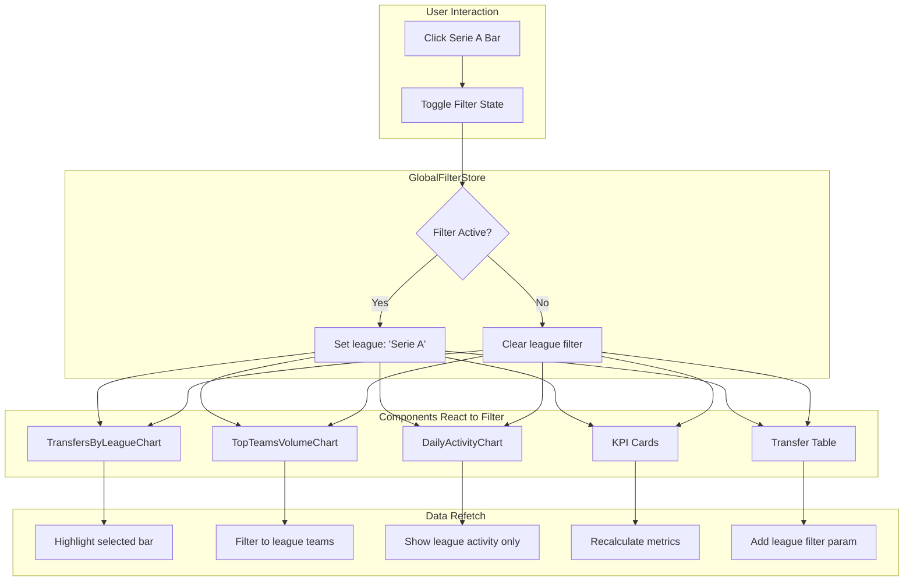

# Plan 2: Cross-Component Filtering Feature

## Problem Statement

Implement PowerBI/Tableau-style interactive filtering where clicking on chart elements (e.g., a league bar in "Transfers by League") filters all other dashboard components (charts, KPI cards, transfer table) to show only relevant data. Clicking the same element again resets the filter.

## Architecture Design

### Filter System Overview



---

## Proposed Changes

### [NEW] [useGlobalFilterStore.ts](file:///Users/camilomeza/Documents/Personal%20Documents/Personal%20Projects/AIDB%20Challenge/Missions/week-04-data-analyst/src/lib/stores/useGlobalFilterStore.ts)

Create a centralized Zustand store for global filter state:

```typescript
import { create } from 'zustand';
import { devtools } from 'zustand/middleware';

export type FilterType = 'league' | 'team' | 'date' | 'position';

export interface GlobalFilter {
  type: FilterType;
  value: string;
  label: string; // Display name
}

export interface GlobalFilterState {
  // Active filters (supports multiple filter types)
  activeFilters: GlobalFilter[];
  
  // Actions
  toggleFilter: (filter: GlobalFilter) => void;
  setFilter: (filter: GlobalFilter) => void;
  removeFilter: (type: FilterType) => void;
  clearAllFilters: () => void;
  
  // Derived selectors
  getFilterByType: (type: FilterType) => GlobalFilter | undefined;
  isFilterActive: (type: FilterType, value: string) => boolean;
}

export const useGlobalFilterStore = create<GlobalFilterState>()(
  devtools(
    (set, get) => ({
      activeFilters: [],
      
      toggleFilter: (filter) => {
        const current = get().activeFilters;
        const existing = current.find(
          f => f.type === filter.type && f.value === filter.value
        );
        
        if (existing) {
          // Remove if clicking same filter (toggle off)
          set({ 
            activeFilters: current.filter(
              f => !(f.type === filter.type && f.value === filter.value)
            )
          });
        } else {
          // Replace any filter of same type, add new one
          set({ 
            activeFilters: [
              ...current.filter(f => f.type !== filter.type),
              filter
            ]
          });
        }
      },
      
      setFilter: (filter) => {
        const current = get().activeFilters;
        set({ 
          activeFilters: [
            ...current.filter(f => f.type !== filter.type),
            filter
          ]
        });
      },
      
      removeFilter: (type) => {
        set({ 
          activeFilters: get().activeFilters.filter(f => f.type !== type)
        });
      },
      
      clearAllFilters: () => set({ activeFilters: [] }),
      
      getFilterByType: (type) => get().activeFilters.find(f => f.type === type),
      
      isFilterActive: (type, value) => 
        get().activeFilters.some(f => f.type === type && f.value === value),
    }),
    { name: 'global-filter-store' }
  )
);
```

---

### [NEW] [ActiveFiltersBar.tsx](file:///Users/camilomeza/Documents/Personal%20Documents/Personal%20Projects/AIDB%20Challenge/Missions/week-04-data-analyst/src/components/features/dashboard/ActiveFiltersBar.tsx)

Visual indicator showing active filters with ability to remove:

```typescript
'use client';

import { X } from 'lucide-react';
import { Badge } from '@/components/ui/badge';
import { Button } from '@/components/ui/button';
import { useGlobalFilterStore } from '@/lib/stores/useGlobalFilterStore';

export function ActiveFiltersBar() {
  const { activeFilters, removeFilter, clearAllFilters } = useGlobalFilterStore();
  
  if (activeFilters.length === 0) return null;
  
  return (
    <div className="flex items-center gap-2 p-3 bg-card/50 rounded-lg border border-border/50 mb-4">
      <span className="text-sm text-muted-foreground">Active filters:</span>
      <div className="flex flex-wrap gap-2">
        {activeFilters.map((filter) => (
          <Badge 
            key={`${filter.type}-${filter.value}`}
            variant="secondary"
            className="flex items-center gap-1 px-2 py-1"
          >
            <span className="text-xs uppercase text-muted-foreground">
              {filter.type}:
            </span>
            <span>{filter.label}</span>
            <button
              onClick={() => removeFilter(filter.type)}
              className="ml-1 hover:text-destructive"
              aria-label={`Remove ${filter.label} filter`}
            >
              <X className="h-3 w-3" />
            </button>
          </Badge>
        ))}
      </div>
      {activeFilters.length > 1 && (
        <Button 
          variant="ghost" 
          size="sm"
          onClick={clearAllFilters}
          className="text-xs"
        >
          Clear all
        </Button>
      )}
    </div>
  );
}
```

---

### [MODIFY] [TransfersByLeagueChart.tsx](file:///Users/camilomeza/Documents/Personal%20Documents/Personal%20Projects/AIDB%20Challenge/Missions/week-04-data-analyst/src/components/features/dashboard/charts/TransfersByLeagueChart.tsx)

Add click handlers for interactive filtering:

```diff
 import { BarChart, Bar, XAxis, YAxis, CartesianGrid, Tooltip, Cell } from "recharts";
 import { ChartContainer } from "./ChartContainer";
 import { CustomTooltip } from "./CustomTooltip";
+import { useGlobalFilterStore } from "@/lib/stores/useGlobalFilterStore";

 // ... existing code ...

 export function TransfersByLeagueChart({
   data,
   isLoading = false,
   error = null,
   className,
   aspectRatio = 16 / 9,
 }: TransfersByLeagueChartProps) {
+  const { toggleFilter, isFilterActive } = useGlobalFilterStore();
+
+  const handleBarClick = (data: TransfersByLeagueData) => {
+    toggleFilter({
+      type: 'league',
+      value: data.league,
+      label: data.league,
+    });
+  };

   return (
     <ChartContainer /* ... existing props ... */>
       <BarChart /* ... existing props ... */>
         {/* ... existing elements ... */}
         <Bar
           dataKey="transfers"
           radius={[4, 4, 0, 0]}
           animationDuration={800}
           animationEasing="ease-out"
+          onClick={(data) => handleBarClick(data)}
+          style={{ cursor: 'pointer' }}
         >
           {data.map((entry, index) => (
             <Cell
               key={`cell-${index}`}
-              fill={index % 2 === 0 ? CHART_COLORS.primary : CHART_COLORS.secondary}
+              fill={
+                isFilterActive('league', entry.league)
+                  ? CHART_COLORS.secondary  // Highlight selected
+                  : index % 2 === 0 
+                    ? CHART_COLORS.primary 
+                    : CHART_COLORS.grid
+              }
+              opacity={
+                // Dim non-selected when filter is active
+                useGlobalFilterStore.getState().getFilterByType('league') &&
+                !isFilterActive('league', entry.league)
+                  ? 0.4
+                  : 1
+              }
             />
           ))}
         </Bar>
       </BarChart>
     </ChartContainer>
   );
 }
```

---

### [MODIFY] [use-summary-query.ts](file:///Users/camilomeza/Documents/Personal%20Documents/Personal%20Projects/AIDB%20Challenge/Missions/week-04-data-analyst/src/hooks/use-summary-query.ts)

Update to accept filter parameters for KPI recalculation:

```diff
 import { useQuery, useQueryClient } from '@tanstack/react-query'
 import { queryKeys, queryConfig } from '@/lib/query-client'
+import { useGlobalFilterStore } from '@/lib/stores/useGlobalFilterStore'

 // ... existing types ...

-const fetchSummary = async (): Promise<SummaryData> => {
-  const response = await fetch('/api/summary')
+const fetchSummary = async (filters: Record<string, string>): Promise<SummaryData> => {
+  const params = new URLSearchParams();
+  Object.entries(filters).forEach(([key, value]) => {
+    if (value) params.set(key, value);
+  });
+  
+  const url = params.toString() 
+    ? `/api/summary?${params.toString()}`
+    : '/api/summary';
+    
+  const response = await fetch(url);
   // ... rest of fetch logic
 }

 export const useSummaryQuery = (initialData?: SummaryData | null) => {
   const hasInitialData = initialData !== undefined && initialData !== null
+  const { activeFilters } = useGlobalFilterStore();
+  
+  // Build filter object for query
+  const filterParams = activeFilters.reduce((acc, filter) => {
+    acc[filter.type] = filter.value;
+    return acc;
+  }, {} as Record<string, string>);

   return useQuery({
-    queryKey: queryKeys.summary,
-    queryFn: fetchSummary,
+    queryKey: [...queryKeys.summary, filterParams],
+    queryFn: () => fetchSummary(filterParams),
     // ... rest of options
   })
 }
```

---

### [MODIFY] [DashboardClient.tsx](file:///Users/camilomeza/Documents/Personal%20Documents/Personal%20Projects/AIDB%20Challenge/Missions/week-04-data-analyst/src/components/dashboard/DashboardClient.tsx)

Add the ActiveFiltersBar component:

```diff
 // Component imports
 import { DashboardKPICards } from '@/components/features/dashboard-kpi-cards'
 import { DashboardCharts } from '@/components/features/dashboard/DashboardCharts'
+import { ActiveFiltersBar } from '@/components/features/dashboard/ActiveFiltersBar'
 import { Sidebar } from '@/components/dashboard/Sidebar'
 // ... other imports

 export function DashboardClient({ /* props */ }: DashboardClientProps) {
   // ... existing code ...

   return (
     <div className="min-h-screen bg-background">
       <motion.div /* ... */>
         {/* Header Section */}
         <motion.header /* ... */ />

+        {/* Active Filters Bar */}
+        <ActiveFiltersBar />

         {/* KPI Cards Section */}
         {/* ... */}
       </motion.div>
     </div>
   );
 }
```

---

### [MODIFY] [/api/summary/route.ts](file:///Users/camilomeza/Documents/Personal%20Documents/Personal%20Projects/AIDB%20Challenge/Missions/week-04-data-analyst/src/app/api/summary/route.ts)

Add filter parsing and apply to database queries:

```typescript
export async function GET(request: NextRequest) {
  const { searchParams } = new URL(request.url);
  
  // Parse filter parameters
  const filters = {
    league: searchParams.get('league'),
    team: searchParams.get('team'),
    date: searchParams.get('date'),
    position: searchParams.get('position'),
  };
  
  // Build Supabase query with filters
  let query = supabase.from('transfers').select('*');
  
  if (filters.league) {
    query = query.eq('league_name', filters.league);
  }
  if (filters.team) {
    query = query.or(`from_club.eq.${filters.team},to_club.eq.${filters.team}`);
  }
  // ... apply other filters
  
  // Continue with existing aggregation logic
}
```

---

### Summary of Files to Modify

| File | Action | Description |
|------|--------|-------------|
| `src/lib/stores/useGlobalFilterStore.ts` | **NEW** | Centralized filter state management |
| `src/components/features/dashboard/ActiveFiltersBar.tsx` | **NEW** | Visual filter indicator component |
| `src/components/features/dashboard/charts/TransfersByLeagueChart.tsx` | MODIFY | Add click handlers, visual feedback |
| `src/components/features/dashboard/charts/TopTeamsVolumeChart.tsx` | MODIFY | Add team filtering on click |
| `src/components/features/dashboard/charts/DailyActivityChart.tsx` | MODIFY | Add date range filtering on click |
| `src/hooks/use-summary-query.ts` | MODIFY | Pass filters to API, update query key |
| `src/hooks/useTransfers.ts` | MODIFY | Add filter params to transfer queries |
| `src/components/dashboard/DashboardClient.tsx` | MODIFY | Add ActiveFiltersBar |
| `src/app/api/summary/route.ts` | MODIFY | Parse and apply filter params |
| `src/lib/api/server-fetchers.ts` | MODIFY | Add filter params to data fetching |

---

## Verification Plan

### Existing Tests to Update

1. **[use-summary-query.test.ts](file:///Users/camilomeza/Documents/Personal%20Documents/Personal%20Projects/AIDB%20Challenge/Missions/week-04-data-analyst/src/hooks/__tests__/use-summary-query.test.ts)** - Add tests for filtered queries

### New Tests Required

1. **Unit tests for `useGlobalFilterStore`**:
```bash
npm test -- src/lib/stores/__tests__/useGlobalFilterStore.test.ts
```

2. **Integration test for filter propagation**:
```bash
npm test -- src/components/features/dashboard/__tests__/filtering.test.tsx
```

### Manual Verification (Browser Testing)

1. **Navigate to dashboard**: Open https://herewegotransfers.vercel.app
2. **Click on a league bar** in "Transfers by League" chart
3. **Verify**:
   - [ ] Clicked bar is visually highlighted (different color)
   - [ ] Other bars are dimmed
   - [ ] ActiveFiltersBar appears showing "league: Serie A"
   - [ ] KPI cards update to show filtered metrics
   - [ ] Transfer table filters to show only Serie A transfers
   - [ ] Top Teams chart shows only Serie A teams
4. **Click the same league bar again**
5. **Verify**:
   - [ ] Filter is removed
   - [ ] All components return to unfiltered state
   - [ ] ActiveFiltersBar disappears
6. **Click "X" on filter badge**
7. **Verify**: Same as step 5

---

## Implementation Order

### Recommended Sequence for Dev 2:

1. Create `useGlobalFilterStore.ts` - foundation for all filtering
2. Create `ActiveFiltersBar.tsx` - visual feedback component  
3. Modify `TransfersByLeagueChart.tsx` - first interactive chart
4. Modify `use-summary-query.ts` and API route - backend support
5. Modify `DashboardClient.tsx` - integrate ActiveFiltersBar
6. Extend to other charts (TopTeamsVolumeChart, DailyActivityChart)
7. Update transfer table hooks to respect global filters