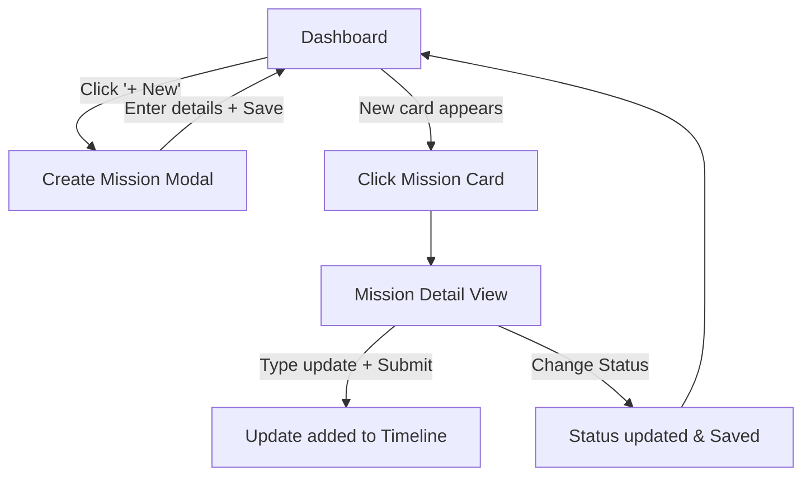

# UI Specification: AI Resolution Tracker

**Mission:** Week 1 - AI Resolution Tracker  
**Designer:** Designer Agent (Cascade)  
**Date:** January 11, 2026  
**Status:** Approved  
**Version:** 1.0

---

## 1. Overview

### Design Summary
The AI Resolution Tracker is designed to be a lightweight, "invisible" companion for challenge participants. The interface prioritizes clarity and speed, minimizing friction between the user and their progress tracking. The aesthetic is clean, modern, and tech-focused, utilizing a card-based layout that adapts seamlessly from mobile to desktop.

### Design Principles
- **Principle 1: Instant Clarity:** Users should understand their overall progress status within 5 seconds of opening the app.
- **Principle 2: Mobile-First:** The experience is optimized for "on-the-go" updates, with large touch targets and stacked layouts as the default.
- **Principle 3: Positive Reinforcement:** UI interactions (like completing a mission or logging progress) should provide subtle but satisfying visual feedback.

### User Experience Goals
- **Efficiency:** Create a new mission or log an update in < 30 seconds.
- **Visibility:** Provide an "at-a-glance" view of all 10 missions without scrolling on desktop.
- **Accessibility:** Fully navigable via keyboard for power users.

---

## 2. Design System

### Color Palette

**Primary Colors (Indigo):**
```
Primary: #4F46E5 (bg-indigo-600) - Primary buttons, active states, key highlights
Primary Hover: #4338CA (bg-indigo-700)
Primary Light: #E0E7FF (bg-indigo-100) - Backgrounds for primary elements
```

**Neutral Colors (Slate):**
```
Background: #F8FAFC (bg-slate-50) - App background
Surface: #FFFFFF (bg-white) - Cards, modals, inputs
Border: #E2E8F0 (border-slate-200)
Text Primary: #0F172A (text-slate-900)
Text Secondary: #64748B (text-slate-500)
Text Disabled: #94A3B8 (text-slate-400)
```

**Semantic Colors:**
```
Success (Completed): #10B981 (text-emerald-600, bg-emerald-50)
Warning (In Progress): #F59E0B (text-amber-600, bg-amber-50)
Error (Blocked): #EF4444 (text-red-600, bg-red-50)
Neutral (Not Started): #64748B (text-slate-500, bg-slate-100)
```

### Typography

**Font Family:**
- Primary: **Inter** (via standard Tailwind sans stack)
- Monospace: **Geist Mono** or System Mono (for IDs/Technical details)

**Type Scale:**
```
Heading 1 (App Title): 24px / 32px / Bold (text-2xl)
Heading 2 (Section): 20px / 28px / Semibold (text-xl)
Heading 3 (Card Title): 16px / 24px / Semibold (text-base)
Body: 14px / 20px / Normal (text-sm)
Small/Caption: 12px / 16px / Medium (text-xs)
```

### Spacing System
Standard Tailwind 4px grid.
- **Container Padding:** `p-4` (mobile) / `p-6` (desktop)
- **Card Padding:** `p-5`
- **Gap:** `gap-4` (16px) standard, `gap-6` (24px) for sections.

### Border Radius
- **Buttons/Inputs:** `rounded-md` (6px) - Matching shadcn/ui default
- **Cards:** `rounded-lg` (8px)
- **Badges:** `rounded-full`

---

## 3. Component Library

### Button
**Variants:**
- **Primary:** `bg-indigo-600 text-white hover:bg-indigo-700` (Main actions: "New Mission", "Add Update")
- **Secondary/Outline:** `border border-slate-200 bg-white hover:bg-slate-100 text-slate-900` (Edit, Cancel)
- **Destructive:** `bg-red-600 text-white hover:bg-red-700` (Delete)
- **Ghost:** `hover:bg-slate-100 text-slate-700` (Icon buttons, simple links)

### Status Badge
**Structure:**
Small pill `rounded-full`, `px-2.5 py-0.5`, `text-xs font-medium`.

**Variants:**
- **Not Started:** `bg-slate-100 text-slate-700`
- **In Progress:** `bg-amber-100 text-amber-700`
- **Completed:** `bg-emerald-100 text-emerald-700`
- **Blocked:** `bg-red-100 text-red-700`

### Mission Card
**Structure:**
- **Container:** `bg-white border border-slate-200 rounded-lg p-5 hover:shadow-md transition-all duration-200 cursor-pointer group`
- **Header:** Title (truncate 1 line) + Status Badge (top-right)
- **Body:** Description (truncate 2 lines, `text-slate-500`)
- **Footer:** "Last update: [Date]" + Progress count icon/label

### Progress Timeline Item
**Structure:**
- **Layout:** Vertical list with connecting line
- **Marker:** Dot (`bg-indigo-600`) on left
- **Content:** Card-like container or simple text block
- **Meta:** Timestamp (`text-xs text-slate-400`)

---

## 4. Screen Specifications

### Screen 1: Dashboard (Home)

**Purpose:** Provide a high-level overview of all missions and quick access to status updates.

**Layout Structure:**
```
┌──────────────────────────────────────────────┐
│  [Header]                                    │
│  AI Resolution Tracker    [+ New Mission]    │
│  [Stats Row: Total | In Prog | Done]         │
├──────────────────────────────────────────────┤
│  [Main Content]                              │
│                                              │
│  ┌──────────┐  ┌──────────┐  ┌──────────┐    │
│  │ Mission  │  │ Mission  │  │ Mission  │    │
│  │ Card     │  │ Card     │  │ Card     │    │
│  └──────────┘  └──────────┘  └──────────┘    │
│                                              │
│  [Empty State Illustration if 0 items]       │
└──────────────────────────────────────────────┘
```

**Responsive Behavior:**
- **Mobile:** 1 column grid. Stats row scrolls horizontally or stacks 2x2.
- **Tablet:** 2 column grid.
- **Desktop:** 3 column grid. Max-width container centered (1200px).

**States:**
- **Empty:** Centered illustration, "No missions found", large "Create your first mission" button.
- **Loading:** Skeleton cards (3-6 items).

### Screen 2: Mission Detail View

**Purpose:** Deep dive into a specific mission to view history and log updates.

**Layout Structure:**
```
┌──────────────────────────────────────────────┐
│  [Nav: ← Back to Dashboard]                  │
├──────────────────────────────────────────────┤
│  [Header]                                    │
│  Mission Title [Status Dropdown]             │
│  [Edit Btn] [Delete Btn]                     │
├──────────────────────────────────────────────┤
│  [Description Section]                       │
│  Full mission description text...            │
├──────────────────────────────────────────────┤
│  [Progress Section]                          │
│                                              │
│  ┌───────────────────────────┐               │
│  │  New Update Textarea...   │               │
│  │  [Log Update Button]      │               │
│  └───────────────────────────┘               │
│                                              │
│  [Timeline]                                  │
│  ○ Today, 2:00 PM                            │
│    Update content...                         │
│                                              │
│  ○ Jan 10, 4:00 PM                           │
│    Previous update...                        │
└──────────────────────────────────────────────┘
```

**Interaction:**
- **Status Dropdown:** Immediate save on change.
- **Log Update:** Clears textarea, optimistically adds to timeline top.

### Screen 3: Create/Edit Mission (Modal)

**Purpose:** Form to capture mission metadata.

**Components:**
- **Title Input:** Text, required, focus on mount.
- **Description Input:** Textarea, optional.
- **Status Select:** (Only on Edit).
- **Actions:** "Cancel" (Ghost), "Create/Save" (Primary).

---

## 5. User Flows

### Flow 1: Create & Track Mission


### Flow 2: Update Mission Status (Quick Action)
*Note: Status can be updated from detail view, but we can also expose a quick action on the card if desired. For MVP, we stick to Detail View for major changes to keep the Dashboard clean, or a simple dropdown on the card.*

**Decision:** Status updates happen primarily in **Mission Detail View** to encourage adding a progress note alongside the status change.

---

## 6. Interactions & Animations

**Micro-interactions:**
- **Card Hover:** `transform: translateY(-2px)`, `shadow-md`, border color darker.
- **Button Click:** `active:scale-95` (subtle press).
- **Status Change:** Badge color transitions smoothly (`duration-300`).

**Transitions:**
- **Page Nav:** Since it's a SPA without a router, we use conditional rendering.
    - Simple fade-in (`opacity-0` -> `opacity-100`) for view switching.
- **List Items:** New progress updates slide down/fade in at the top of the list.

**Loading States:**
- **Initial Load:** Full page skeleton (Header + Grid of 3 skeletons).
- **Submitting Update:** Button shows spinner, disabled state.

---

## 7. Accessibility Specifications

### WCAG 2.1 AA Targets
- **Contrast:** All text meets 4.5:1. Indigo-600 on white is ~8.9:1.
- **Focus:** All interactive elements have `focus-visible:ring-2 ring-indigo-500 ring-offset-2`.
- **Semantic HTML:**
    - Mission Cards are `<article>` or `<li>` within `<ul>`.
    - Headings strictly follow `h1` (App Title) -> `h2` (Page Title) -> `h3` (Section/Card Title).
- **ARIA:**
    - Status badges have `aria-label="Status: [Status Name]"`.
    - Icon-only buttons (like delete trash icon) must have `aria-label`.

---

## 8. Responsive Strategy

**Mobile First Approach:**
1.  **Phone (< 640px):**
    - Padding: `p-4`.
    - Cards: Full width.
    - Actions: Fixed bottom bar or distinct buttons at top/bottom of sections.
2.  **Tablet (640px+):**
    - Grid: 2 columns for missions.
    - Modal: Centered with overlay (vs full screen on mobile).
3.  **Desktop (1024px+):**
    - Grid: 3 columns.
    - Layout: Centered max-width 1024px or 1280px.

---

## 9. Error Handling & Empty States

### Empty States
**Dashboard (No Missions):**
- **Icon:** Rocket or Checklist illustration (Lucide `Rocket` icon).
- **Text:** "Ready to start your AI journey?"
- **Subtext:** "Create your first mission to begin tracking your progress."
- **Action:** Primary Button "Create Mission".

**Mission Detail (No Updates):**
- **Text:** "No updates yet."
- **Subtext:** "Log your first milestone to get the ball rolling."

### Error States
- **Storage Full:**
    - **UI:** Red banner at top of Dashboard.
    - **Text:** "Local storage is full. Please delete old missions to make space."
- **Form Validation:**
    - **UI:** Red border on input + Red text below.
    - **Message:** "Title is required."

---

## 10. Open Questions / Exploratory Zone

- **[ ] Drag and Drop:** Should users be able to reorder missions? (Moved to V2).
- **[ ] Dark Mode:** Technically easy with Tailwind, but strict requirement for MVP? (Assuming Light Mode default for MVP speed, Dark Mode optional).
- **[ ] Markdown:** Should progress updates support basic markdown? (Tech spec says text-based, sticking to plain text with whitespace preservation for MVP).

---

## 11. References
- **PRD:** `M1-PRD.md`
- **Tech Spec:** `M1-Tech-Spec.md`
- **Design System:** Tailwind CSS + shadcn/ui defaults

---
**Approval:**
- [x] PM (Jan 11, 2026)
- [x] Tech Lead (Jan 11, 2026)
- [x] Designer (Self)
