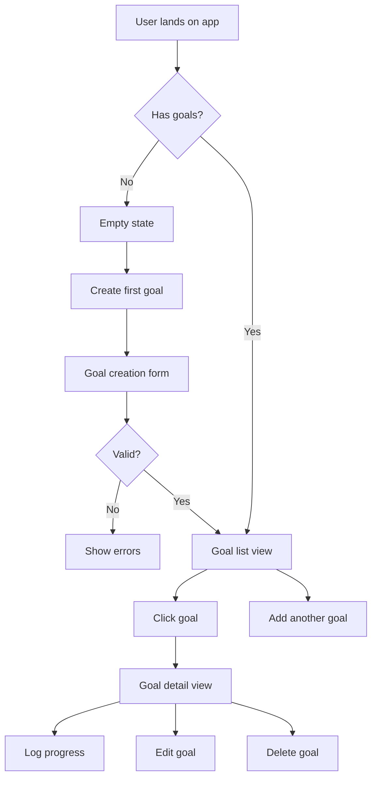

# UI Specification Workflow

This workflow guides the Designer through creating a comprehensive UI Specification that complements the Product and Technical specs.

## Prerequisites
- Approved or near-approved PRD
- Approved or near-approved Tech Spec
- Understanding of user needs and technical constraints

## Spec-Driven Context
**This UI Spec defines the user-facing behavior and design system** including:
- User flows and information architecture (Stable Zone)
- Component specifications and interactions (Flexible Zone with some Stable elements)
- Visual design tokens (Flexible Zone)
- Accessibility requirements (Stable Zone)

**Target**: Move from Draft → Reviewed → Approved quickly, defining guardrails not pixel-perfect mockups.

## Step 1: Review Context (30 minutes)

**Read PRD:**
- Who are the users?
- What are their goals?
- What user stories exist?
- What's the core value proposition?
- What's MVP vs future?

**Read Tech Spec:**
- What's the component structure?
- What data is available?
- What are technical constraints?
- What's the state management approach?
- What's performance budget?

**Extract design implications:**
- What screens/views are needed?
- What interactions are required?
- What states must be designed?
- What's complex vs simple?
- What could change vs what must be stable?

## Step 2: Define Stable vs Flexible Zones (15 minutes)

**Stable Zone (Locked - requires re-approval):**
- User flow structure
- Information architecture
- Navigation patterns
- Accessibility requirements
- Core interaction patterns
- Critical component contracts (props/behavior)

**Flexible Zone (Can change during build):**
- Visual styling details
- Color shades (within palette)
- Spacing adjustments
- Animation timings
- Micro-interactions
- Error message wording
- Icon choices

**Exploratory Zone (TBD):**
- Unclear interaction patterns
- Complex UX problems
- Accessibility edge cases
- Responsive breakpoint decisions

**Document these zones** in your spec.

## Step 3: User Flow Design (45 minutes)

**Map all user journeys** (Stable Zone)

### Create flow diagrams in Mermaid


**For each major flow, document:**
1. **Entry point**: How does user get here?
2. **Steps**: What actions do they take?
3. **Decision points**: Where do paths branch?
4. **Happy path**: The ideal journey
5. **Error paths**: What goes wrong?
6. **Exit points**: Where do they end up?

## Step 4: Information Architecture (30 minutes)

**Define screen/view structure** (Stable Zone)

### Example Structure
```
App Shell
├── Header
│   ├── Logo/Title
│   └── Actions
│
└── Main Content
    ├── View 1 [/]
    ├── View 2 [/path]
    └── View 3 [/path/:id]
```

**For each screen, define:**
- **Purpose**: Why does this screen exist?
- **Content**: What information is shown?
- **Actions**: What can users do?
- **Navigation**: How do users get here/leave?
- **Priority**: MVP or future?

## Step 5: Wireframes (1-2 hours)

**Create text-based wireframes** for each screen

### Wireframe Template
```
┌────────────────────────────────────────────┐
│  Header Section                            │
├────────────────────────────────────────────┤
│                                            │
│  Main Content Area                         │
│                                            │
│  [Interactive Element]                     │
│                                            │
└────────────────────────────────────────────┘
```

**Include wireframes for:**
- Default state
- Empty state
- Loading state
- Error state
- Success state

## Step 6: Component Specifications (2-3 hours)

**For each component, document:**

### Component Template
```markdown
### ComponentName

**Purpose**: What this component does

**Props**:
- `prop1` (type): Description
- `prop2` (type, optional): Description

**States**:
- Default: Base appearance
- Hover: `hover:classes`
- Focus: `focus:classes`
- Active: `active:classes`
- Disabled: `disabled:classes`
- Error: When validation fails
- Loading: During async operations

**Tailwind Classes**:
```
Base: bg-white border border-gray-300 rounded-lg p-4
Hover: hover:border-blue-500 hover:shadow-sm
Focus: focus:ring-2 focus:ring-blue-500 focus:border-blue-500
```

**Responsive**:
- Mobile (< 640px): stack vertically
- Tablet (640px+): 2-column
- Desktop (1024px+): 3-column

**Accessibility**:
- ARIA label: "descriptive label"
- Keyboard: Tab to focus, Enter/Space to activate
- Screen reader: Announces state changes
```

**Priority components to specify:**
- Buttons (primary, secondary, ghost, danger)
- Form inputs (text, textarea, select, checkbox, radio)
- Cards
- Modals/Dialogs
- Lists/Grids
- Navigation elements

## Step 7: Design System (1 hour)

**Define design tokens** (Flexible Zone)

### Color Palette
```markdown
**Neutrals**:
- Background: bg-white, bg-gray-50, bg-gray-100
- Text: text-gray-900, text-gray-700, text-gray-500
- Borders: border-gray-200, border-gray-300

**Primary** (choose one):
- Blue: bg-blue-600, text-blue-600, border-blue-600
- Indigo: bg-indigo-600, text-indigo-600
- Emerald: bg-emerald-600, text-emerald-600

**Semantic**:
- Success: text-emerald-600, bg-emerald-50
- Error: text-red-600, bg-red-50
- Warning: text-amber-600, bg-amber-50
- Info: text-blue-600, bg-blue-50
```

### Typography
```markdown
**Scale**:
- xs: text-xs (12px)
- sm: text-sm (14px)
- base: text-base (16px)
- lg: text-lg (18px)
- xl: text-xl (20px)
- 2xl: text-2xl (24px)
- 3xl: text-3xl (30px)

**Weights**:
- Normal: font-normal (400)
- Medium: font-medium (500)
- Semibold: font-semibold (600)
- Bold: font-bold (700)

**Usage**:
- Page titles: text-3xl font-bold
- Section headers: text-2xl font-semibold
- Body: text-base font-normal
- Labels: text-sm font-medium
- Captions: text-xs text-gray-500
```

### Spacing
```markdown
- xs: space-1 (4px)
- sm: space-2 (8px)
- md: space-4 (16px)
- lg: space-6 (24px)
- xl: space-8 (32px)
- 2xl: space-12 (48px)
```

### Responsive Breakpoints
```markdown
- Mobile: < 640px (default)
- Tablet: sm: 640px+
- Desktop: md: 768px+, lg: 1024px+
- Large: xl: 1280px+
```

## Step 8: Interaction Patterns (45 minutes)

**Document key interactions** (mix of Stable and Flexible)

### Hover Effects
```markdown
- Buttons: Scale slightly (scale-105), darken color
- Cards: Add shadow (hover:shadow-md), lift effect
- Links: Underline, color change
- Icons: Color change, subtle rotation
```

### Transitions
```markdown
- Duration: 200ms (fast), 300ms (standard)
- Easing: ease-in-out
- Properties: colors, transform, opacity, shadow
```

### Loading States
```markdown
- Buttons: Show spinner, disable interaction, text changes to "Loading..."
- Forms: Disable all inputs, show overlay
- Data lists: Show skeleton screens
- Images: Show placeholder with pulse animation
```

### Error States
```markdown
- Form inputs: Red border, red text below, shake animation
- Toast notifications: Red background, error icon, auto-dismiss
- Inline messages: Red background, error icon, dismiss button
```

## Step 9: Accessibility Specification (1 hour)

**Define accessibility requirements** (Stable Zone)

### WCAG 2.1 AA Compliance

**Color Contrast**:
- Normal text: 4.5:1 minimum
- Large text (18px+): 3:1 minimum
- UI components: 3:1 minimum
- Test with: WebAIM contrast checker

**Keyboard Navigation**:
- Tab order: Logical, follows visual flow
- Focus indicators: Visible ring (ring-2 ring-blue-500)
- Shortcuts: Document all keyboard shortcuts
- No keyboard traps: Can escape all modals/dialogs

**Screen Reader Support**:
- Semantic HTML: Use proper elements (button, nav, main, etc.)
- ARIA labels: Add where semantic HTML insufficient
- Alt text: All images have descriptive alt text
- Form labels: All inputs properly labeled
- State announcements: Use aria-live for dynamic content

**Touch Targets**:
- Minimum size: 44x44px
- Spacing: 8px minimum between targets
- Mobile-friendly: Large enough for fingers

### Accessibility Checklist
```markdown
- [ ] All interactive elements keyboard accessible
- [ ] Focus indicators visible on all focusable elements
- [ ] Color contrast meets WCAG AA standards
- [ ] All images have alt text
- [ ] Forms have associated labels
- [ ] Error messages are descriptive and announced
- [ ] Modals can be closed with Escape
- [ ] No content disappears on zoom (200%)
- [ ] Touch targets are 44x44px minimum
```

## Step 10: Responsive Design Strategy (45 minutes)

**Define responsive behavior** (Flexible Zone)

### Mobile First Approach
1. Design for mobile (320px+) first
2. Enhance for tablet (640px+)
3. Optimize for desktop (1024px+)

### Common Patterns

**Navigation**:
- Mobile: Hamburger menu or bottom nav
- Desktop: Horizontal nav or sidebar

**Layout**:
- Mobile: Single column, stacked
- Tablet: 2-column where appropriate
- Desktop: Multi-column, sidebars

**Content**:
- Mobile: Essential content only, shorter text
- Desktop: More context, additional features

### Example Responsive Specs
```markdown
### Goal Card
**Mobile (< 640px)**:
- Full width
- Stack all content vertically
- Larger touch targets (48px)
- Hide secondary actions in menu

**Tablet (640px+)**:
- 2 cards per row
- Show category inline
- Actions visible on hover

**Desktop (1024px+)**:
- 3 cards per row
- Show all metadata
- Hover effects enabled
```

## Step 11: Empty States (30 minutes)

**Design for every empty state**

### Types of Empty States
1. **First use**: No data created yet
2. **User cleared**: Data was deleted
3. **No results**: Search/filter returned nothing
4. **Error occurred**: Failed to load data
5. **Permission denied**: User can't access

### Empty State Pattern
```
┌────────────────────────────────────────────┐
│                                            │
│              [Icon/Illustration]           │
│                                            │
│         Clear Headline                     │
│    Brief explanation of why empty         │
│                                            │
│        [Primary Action Button]             │
│                                            │
└────────────────────────────────────────────┘
```

**Guidelines**:
- Use friendly, encouraging tone
- Explain why empty
- Provide clear next action
- Use appropriate illustration/icon
- Keep text concise

## Step 12: Error Handling UI (30 minutes)

**Design error experiences**

### Error Types
1. **Validation errors**: User input invalid
2. **Network errors**: Connection/API failed
3. **Server errors**: Backend problem
4. **Not found**: Resource doesn't exist
5. **Permission denied**: Unauthorized

### Error UI Patterns
```markdown
**Inline Form Errors**:
- Red border on input
- Red error text below
- Error icon
- Keep previous input visible
- Allow easy correction

**Toast Notifications**:
- Appear top-right or bottom-center
- Auto-dismiss after 5s (or manual dismiss)
- Error icon + message
- Action button optional (e.g., "Retry")

**Error Pages**:
- Clear explanation
- Helpful suggestions
- Action to recover (e.g., "Go Home", "Try Again")
- Friendly tone, no technical jargon
```

## Step 13: Create UI Spec Document (1 hour)

Use `/templates/ui-spec-template.md`

**Fill in all sections:**
1. Overview & Goals
2. Stable vs Flexible vs Exploratory Zones
3. User Flows (with Mermaid diagrams)
4. Information Architecture
5. Wireframes (all key screens + states)
6. Component Specifications
7. Design System (colors, typography, spacing)
8. Interaction Patterns
9. Accessibility Requirements
10. Responsive Strategy
11. Empty States
12. Error Handling
13. Open Questions (Exploratory Zone)

## Step 14: Review & Validation (30-60 minutes)

**Self-review checklist:**
- [ ] All user flows mapped
- [ ] All screens wireframed
- [ ] All states designed (default, hover, focus, error, loading, empty)
- [ ] Component specifications complete
- [ ] Design system defined
- [ ] Accessibility requirements specified
- [ ] Responsive behavior documented
- [ ] Stable zones clearly marked
- [ ] No major open questions in Stable Zone

**Share with PM:**
- Does this UX deliver on user needs?
- Are flows intuitive?
- Any scope adjustments needed?

**Share with Tech Lead:**
- Are component specs clear enough to implement?
- Are there technical constraints affecting UX?
- Are interactions technically feasible?

**Iterate:**
- Address feedback
- Clarify ambiguities
- Adjust design based on constraints
- Resolve Exploratory Zone questions

**Get approval:**
- PM approves user experience
- Tech Lead approves feasibility
- Move spec to "Approved" state
- Proceed to implementation planning

## Quality Checklist
Before marking spec as Approved:
- [ ] All sections complete
- [ ] Stable/Flexible/Exploratory zones defined
- [ ] User flows documented with diagrams
- [ ] Information architecture clear
- [ ] Wireframes for all key screens
- [ ] All UI states designed
- [ ] Component specs detailed
- [ ] Design system documented
- [ ] Accessibility requirements specified
- [ ] Responsive strategy defined
- [ ] PM has reviewed and approved
- [ ] Tech Lead has reviewed and approved
- [ ] Saved in project docs folder

## Red Flags to Avoid
- ❌ Pixel-perfect mockups too early (over-specifying Flexible Zone)
- ❌ Missing states (loading, error, empty)
- ❌ Ignoring accessibility
- ❌ Designing for desktop only
- ❌ Unclear component contracts
- ❌ No empty state designs
- ❌ Inconsistent design patterns
- ❌ Unclear interaction feedback

## Remember
This spec provides guardrails, not pixel-perfect mockups. The Stable Zone ensures consistency in flows and accessibility. The Flexible Zone gives freedom in visual polish. Define the "what" clearly, allow flexibility in the "how."